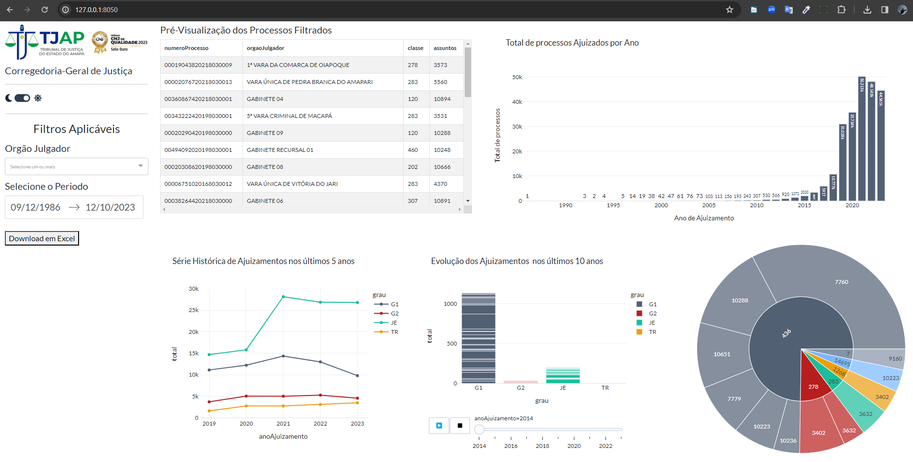

Painel com gráficos dinâmicos dos dados obtidos como resultado do projeto gravado no repositório: [API_Publica_DataJUD](https://github.com/gigateo/API_Publica_DataJUD) . 

Através de uma interface simples e funcional, é possível filtrar e visualizar sob várias perspectivas, além de gerar uma nova planilha contendo apenas os dados que foram filtrados. 
##

    

##

Basta seguir os sequintes passos:

# 1
Adicione o caminho da planilha que foi gerada com o proetjo [API_Publica_DataJUD] (https://github.com/gigateo/API_Publica_DataJUD) na linha 22 do arquivo *index.py*

# 2
execute o arquivo index.py
